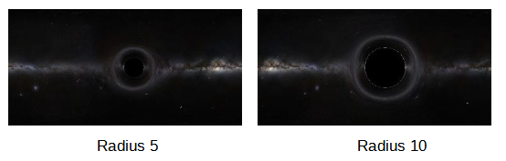

# Computer-Vision-for-Black-Holes

What can deep learning-based computer vision teach us about General Relativity and Black Holes? In these notebooks we train a Convolutional Neural Network (CNN) to identify properties of a black hole based on observed gravitational lensing. 

Gravitational lensing is a phenomenon predicted by Albert Einstein's theory of general relativity. In essence, it involves the bending of light by massive objects, such as stars, galaxies, and indeed, black holes.

This happens because, according to Einstein's theory, mass-energy can warp the fabric of spacetime. If you think of spacetime as a rubber sheet and place a heavy object (like a black hole) on that sheet, it would cause a deep depression. If a smaller object (analogous to a light beam) was then rolled on this sheet, it would not follow a straight line, but would instead be deflected along the depression caused by the heavier object. This is what we call gravitational lensing.

When it comes to black holes, the effect can be quite dramatic. A black hole is a region of space with a gravitational field so intense that nothing, not even light, can escape it. When a beam of light comes close to a black hole but doesn't fall directly in, it is severely deflected. This can result in a variety of interesting effects, such as an Einstein ring, where the black hole causes the light from a source directly behind it (from our perspective) to be bent around it in a ring-like structure.

In these notebooks we train a convolutional neural network (CNN) to classify the size of a black hole based on images of the gravitational lensing effect on images of the Milky Way galaxy. 

Convolutional Neural Networks (CNNs) are a type of deep learning model specifically designed for processing structured grid-like data, such as images or sequences. CNNs have been widely successful in computer vision tasks such as image classification, object detection, and image segmentation.

The key concept behind CNNs is the convolution operation. Convolution involves applying a series of learnable filters or kernels to the input data, typically in the form of a 2D matrix. These filters are small in size and slide over the input data, computing the dot product between the filter values and the corresponding input values. This process results in a feature map that highlights relevant patterns or features in the input.

Here are the general steps involved in the working of a CNN:

Input Layer: The input to a CNN is typically an image, represented as a grid of pixel values. Each pixel can be considered as a separate input unit.

Convolutional Layer: The convolutional layer is responsible for performing the convolution operation. It applies a set of filters to the input image, producing multiple feature maps. Each filter captures different patterns or features in the input.

Activation Function: After each convolutional operation, an activation function is applied element-wise to introduce non-linearity into the network. Common choices for activation functions include ReLU (Rectified Linear Unit), sigmoid, or tanh.

Pooling Layer: Pooling layers are used to downsample the spatial dimensions of the feature maps while preserving important features. Max pooling is a popular technique where the maximum value in a local neighborhood is retained while discarding the rest, effectively reducing the spatial size.

Flattening: After several convolutional and pooling layers, the resulting feature maps are flattened into a one-dimensional vector. This flattening process ensures that the output can be connected to the subsequent fully connected layers.

Fully Connected Layer: In this layer, every neuron is connected to every neuron in the subsequent layer. The fully connected layer takes the flattened feature vector as input and learns complex patterns and relationships in the data.

Output Layer: The final layer of the CNN is the output layer, which produces the desired output. The number of neurons in this layer depends on the specific task. For example, in image classification, the output layer may have neurons representing different classes, and the highest activation indicates the predicted class.

Backpropagation and Training: CNNs are trained using backpropagation, where the error between the predicted output and the actual output is used to adjust the network's parameters. This process involves updating the weights of the filters and fully connected layers using optimization algorithms like gradient descent.

By stacking multiple convolutional layers, pooling layers, and fully connected layers, CNNs are capable of automatically learning hierarchical representations of input data. The initial layers learn low-level features like edges and corners, while deeper layers learn more complex features and patterns. This hierarchical approach allows CNNs to effectively capture spatial relationships and dependencies in the input data, making them well-suited for image analysis tasks.